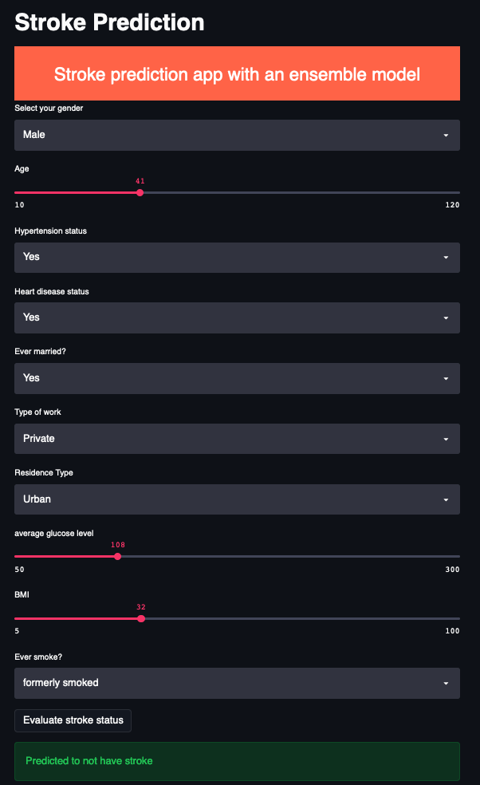

# stroke_prediction

Streamlit demo: http://18.222.138.198:8501

## For the streamlit app 
1. Build the docker image
```
docker image build -t stroke_api .
```
2. Run the container
```
docker container run -p 8501:8501 -d stroke_api
```



## For the flask backend
1. Clone this repository
2. Start your MongoDB locally
3. `export FLASK_APP=flask_app.py` and `python -m flask run`
4. Play with it using Postman etc. Using POST requests, You can
  - Register for an account
  - Predict stroke status
  - Retrive prediction records of an account
